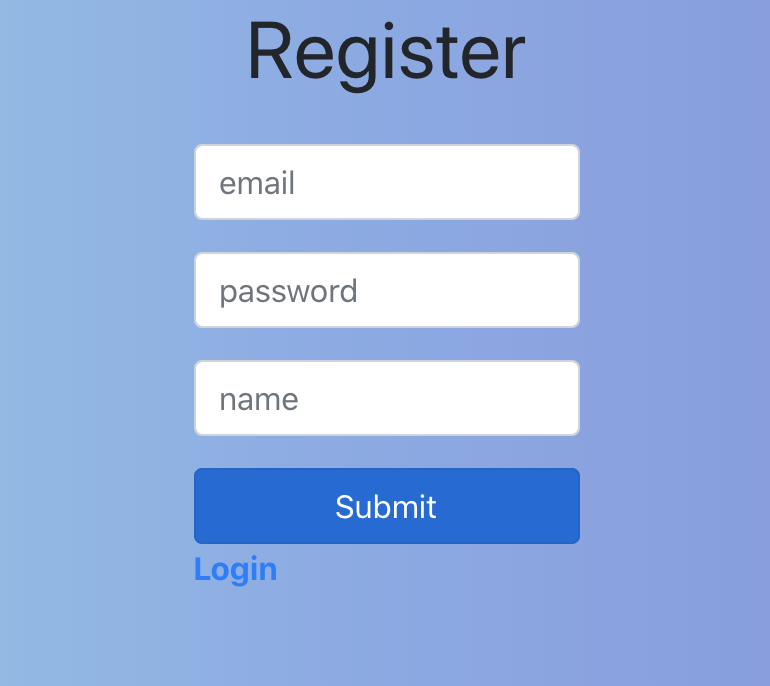
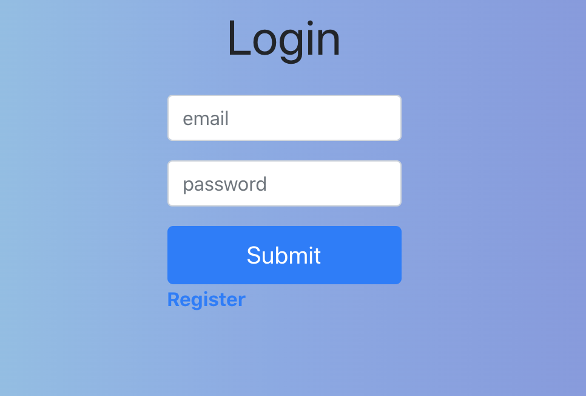
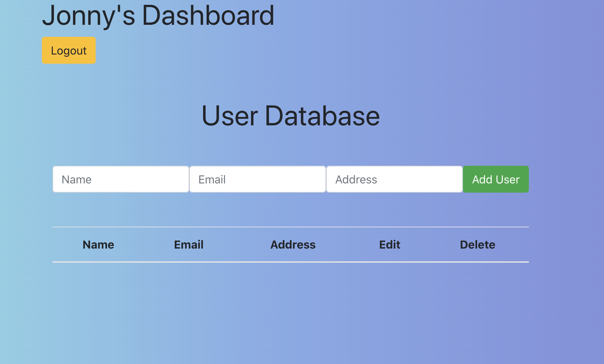
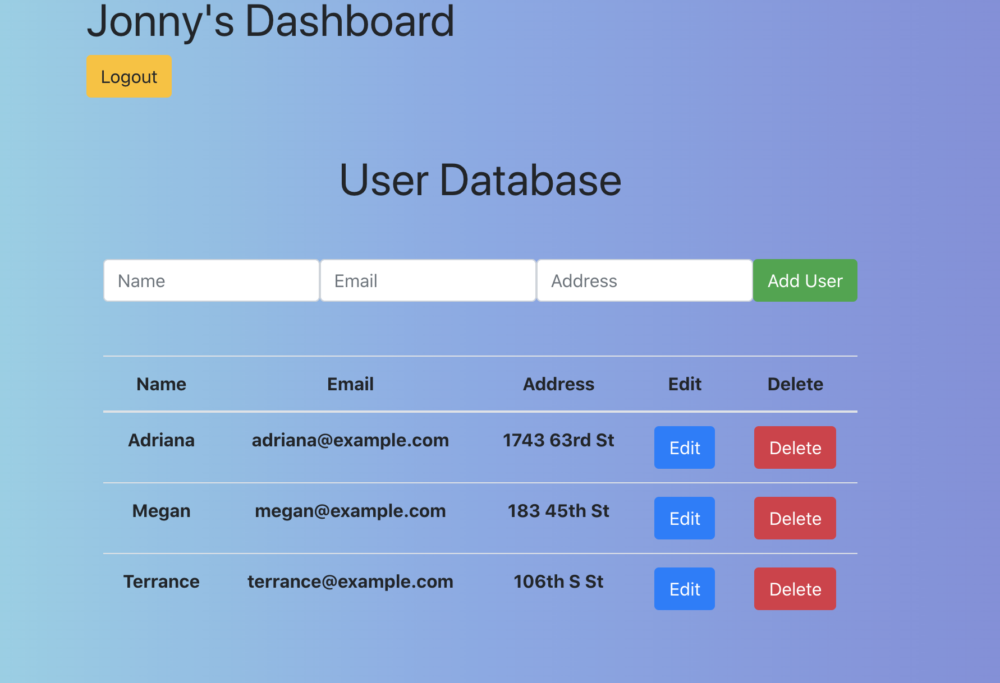

# Nearapogee Sample Application

### Author: Jonny Graybill

# Application Information
* This application can be used as any sort of database that needs CRUD functionality. As a demo, I designed it to be used as a system that could allow users to be created, who could then use CRUD methods (once logged in) to build a database of clients. 
* This application runs on Nodejs with Express for the back end, a Postgresql database, and React for the front end. It is a barebones authentication and REST api that can be run in a dev environment - additional configurations required for any deployments.
* PORT runs on 5000

## Setup

### Postgresql
1. Install postgres
2. Terminal command `psql`
3. If necessary, create a role to use with configuration of the database
4. Follow commands in order listed in `database.sql`

### .env Configuration
```javascript
PG_USER = psqluser
PG_PASSWORD = password
PG_HOST = localhost
PG_PORT = 5432
PG_DATABASE = nearapogee_auth
jwtSecret = 123 (replace with better secret)
```

### Instructions Via Terminal
1. Git clone repository
2. cd into the root of the repository
3. Run `npm install` to create a package-lock.json and node-modules folder for the server-side
4. Create and configure a `.env` file
5. Enter terminal command `nodemon` or `node index.js` to start the server
6. Open a new tab in the terminal window
7. cd into the client folder of the repository
8. Run `npm install` to create a package-lock.json and node-modules folder for the client-side
9. Run terminal command `npm start`

### Migration Instructions
* The following steps show how to run migrations for the addition of a phone number
1. In root directory, run `npm run migrate create add phone`
2. A `migrations` folder will appear with the code
3. Replace contents with:
```javascript
  exports.up = (pgm) => {
    pgm.addColumns('users', {
      phone: { type: 'text' },
    })
  };

  exports.down = (pgm) => {
    pgm.dropColumns('users', {
      phone: { type: 'text' },
    })
  };
```
4. Run terminal command `DATABASE_URL=postgres://<username>:<password>@<host>:<port>/<databasename> npm run migrate up`
 * DATABASE_URL can be set as an environmental variable 
5. Step 4 can be run the same way except with `npm run migrate down` to rollback changes

### Components
#### Dashboard.js
#### EditUser.js
#### InputUser.js
#### ListUsers.js
#### Login.js
#### Register.js

### Libraries/Resources/Dependencies
* node & express for server and back end
* react via create-react-app
  * react-router, react-router-dom, react-scripts, react-toastify
* node-pg-migrate for migrations
* dotenv
* jsonwebtoken
* bcrypt
* cors
* pg
* nodemon
* toastify
* bootstrap 4

#### Running the app
* `nodemon` should start index.js in root
* cd into client folder
* `npm start` should start the react application, which will open a browser window and route you to login, register, or your dashboard if you are already authenticated

### Links and Resources
* [Psql commands](http://postgresguide.com/utilities/psql.html)
* [node-pg-migrate](https://github.com/salsita/node-pg-migrate/tree/5d5e040f423f887030b3dfef63848ccedfca3544)
* [React docs](https://reactjs.org/docs/getting-started.html)
* [React useState hook](https://reactjs.org/docs/hooks-state.html)
* [Express routing](https://expressjs.com/en/guide/routing.html)
* [Cors](https://developer.mozilla.org/en-US/docs/Web/HTTP/CORS)
* [Nodejs downloads](https://nodejs.org/en/)
* [To-Do App Walkthrough](https://www.youtube.com/watch?v=ldYcgPKEZC8)
* [Bootstrap Styling](https://getbootstrap.com/docs/4.0/layout/overview/)

### Sample




